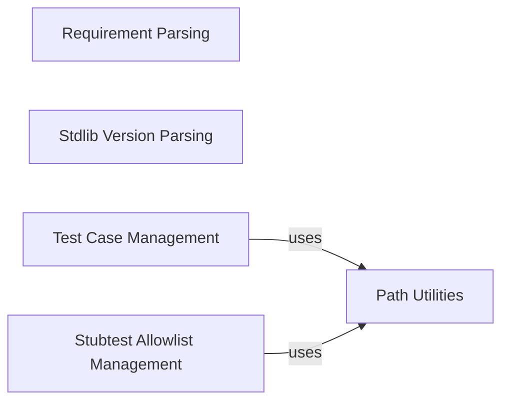

## Component Details

This graph illustrates the internal structure and interactions within the `GeneralUtils` subsystem of the typeshed project. It highlights how different sub-components handle tasks such as parsing requirements and standard library versions, managing test case directories, and generating stubtest allowlists, all while leveraging common path utility functions.

### Requirement Parsing
This component is responsible for parsing and managing project requirements, specifically focusing on extracting mypy requirements from the `requirements-tests.txt` file.

**Related Classes/Methods**:

- <a href="https://github.com/python/typeshed/blob/master/lib/ts_utils/utils.py#L106-L107" target="_blank" rel="noopener noreferrer">`typeshed.lib.ts_utils.utils:get_mypy_req` (106:107)</a>
- <a href="https://github.com/python/typeshed/blob/master/lib/ts_utils/utils.py#L97-L103" target="_blank" rel="noopener noreferrer">`typeshed.lib.ts_utils.utils:parse_requirements` (97:103)</a>

### Stdlib Version Parsing
This component handles the parsing of the `stdlib/VERSIONS` file to determine supported Python versions for different modules.

**Related Classes/Methods**:

- <a href="https://github.com/python/typeshed/blob/master/lib/ts_utils/utils.py#L122-L136" target="_blank" rel="noopener noreferrer">`typeshed.lib.ts_utils.utils:parse_stdlib_versions_file` (122:136)</a>
- <a href="https://github.com/python/typeshed/blob/master/lib/ts_utils/utils.py#L34-L35" target="_blank" rel="noopener noreferrer">`typeshed.lib.ts_utils.utils:strip_comments` (34:35)</a>
- <a href="https://github.com/python/typeshed/blob/master/lib/ts_utils/utils.py#L147-L150" target="_blank" rel="noopener noreferrer">`typeshed.lib.ts_utils.utils._parse_version` (147:150)</a>

### Test Case Management
This component manages the identification and retrieval of test case directories for both standard library and third-party distributions.

**Related Classes/Methods**:

- <a href="https://github.com/python/typeshed/blob/master/lib/ts_utils/utils.py#L167-L175" target="_blank" rel="noopener noreferrer">`typeshed.lib.ts_utils.utils:distribution_info` (167:175)</a>
- <a href="https://github.com/python/typeshed/blob/master/lib/ts_utils/utils.py#L178-L186" target="_blank" rel="noopener noreferrer">`typeshed.lib.ts_utils.utils:get_all_testcase_directories` (178:186)</a>
- <a href="https://github.com/python/typeshed/blob/master/lib/ts_utils/paths.py#L32-L33" target="_blank" rel="noopener noreferrer">`typeshed.lib.ts_utils.paths:test_cases_path` (32:33)</a>

### Stubtest Allowlist Management
This component is responsible for generating and managing allowlist arguments for the stubtest tool. It determines the appropriate allowlist files based on the distribution name, platform, and Python version.

**Related Classes/Methods**:

- <a href="https://github.com/python/typeshed/blob/master/lib/ts_utils/utils.py#L247-L253" target="_blank" rel="noopener noreferrer">`typeshed.lib.ts_utils.utils:allowlist_stubtest_arguments` (247:253)</a>
- <a href="https://github.com/python/typeshed/blob/master/lib/ts_utils/utils.py#L189-L201" target="_blank" rel="noopener noreferrer">`typeshed.lib.ts_utils.utils.allowlists` (189:201)</a>
- <a href="https://github.com/python/typeshed/blob/master/lib/ts_utils/paths.py#L36-L40" target="_blank" rel="noopener noreferrer">`typeshed.lib.ts_utils.paths:allowlists_path` (36:40)</a>

### Path Utilities
This component provides utility functions for constructing various file paths within the typeshed project.

**Related Classes/Methods**:

- <a href="https://github.com/python/typeshed/blob/master/lib/ts_utils/paths.py#L32-L33" target="_blank" rel="noopener noreferrer">`typeshed.lib.ts_utils.paths:test_cases_path` (32:33)</a>
- <a href="https://github.com/python/typeshed/blob/master/lib/ts_utils/paths.py#L36-L40" target="_blank" rel="noopener noreferrer">`typeshed.lib.ts_utils.paths:allowlists_path` (36:40)</a>

### [FAQ](https://github.com/CodeBoarding/GeneratedOnBoardings/tree/main?tab=readme-ov-file#faq)