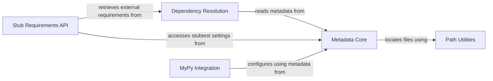

## Component Details

This graph illustrates the architecture of the `MetadataManager` subsystem, which is central to handling typeshed stub metadata. It encompasses functionalities for reading, updating, and parsing metadata, managing stubtest settings, resolving dependencies, generating MyPy configurations, and providing essential path utilities. The core purpose is to ensure accurate and consistent management of stub information and its related configurations within the typeshed project.

### Metadata Core
Manages all aspects of stub metadata, including reading, updating, and parsing dependencies from METADATA.toml files. It defines data structures for stub metadata and stubtest settings, and provides utilities for mapping PyPI names to Typeshed names and recursively gathering requirements.

**Related Classes/Methods**:

- <a href="https://github.com/python/typeshed/blob/master/lib/ts_utils/metadata.py#L57-L59" target="_blank" rel="noopener noreferrer">`typeshed.lib.ts_utils.metadata:metadata_path` (57:59)</a>
- <a href="https://github.com/python/typeshed/blob/master/lib/ts_utils/metadata.py#L64-L85" target="_blank" rel="noopener noreferrer">`typeshed.lib.ts_utils.metadata.StubtestSettings` (64:85)</a>
- <a href="https://github.com/python/typeshed/blob/master/lib/ts_utils/metadata.py#L81-L85" target="_blank" rel="noopener noreferrer">`typeshed.lib.ts_utils.metadata.StubtestSettings:system_requirements_for_platform` (81:85)</a>
- <a href="https://github.com/python/typeshed/blob/master/lib/ts_utils/metadata.py#L89-L139" target="_blank" rel="noopener noreferrer">`typeshed.lib.ts_utils.metadata:read_stubtest_settings` (89:139)</a>
- <a href="https://github.com/python/typeshed/blob/master/lib/ts_utils/metadata.py#L144-L165" target="_blank" rel="noopener noreferrer">`typeshed.lib.ts_utils.metadata.StubMetadata` (144:165)</a>
- <a href="https://github.com/python/typeshed/blob/master/lib/ts_utils/metadata.py#L206-L316" target="_blank" rel="noopener noreferrer">`typeshed.lib.ts_utils.metadata:read_metadata` (206:316)</a>
- <a href="https://github.com/python/typeshed/blob/master/lib/ts_utils/metadata.py#L319-L333" target="_blank" rel="noopener noreferrer">`typeshed.lib.ts_utils.metadata:update_metadata` (319:333)</a>
- <a href="https://github.com/python/typeshed/blob/master/lib/ts_utils/metadata.py#L336-L338" target="_blank" rel="noopener noreferrer">`typeshed.lib.ts_utils.metadata:parse_requires` (336:338)</a>
- <a href="https://github.com/python/typeshed/blob/master/lib/ts_utils/metadata.py#L50-L54" target="_blank" rel="noopener noreferrer">`typeshed.lib.ts_utils.metadata:get_oldest_supported_python` (50:54)</a>
- <a href="https://github.com/python/typeshed/blob/master/lib/ts_utils/metadata.py#L41-L42" target="_blank" rel="noopener noreferrer">`typeshed.lib.ts_utils.metadata:_is_list_of_strings` (41:42)</a>
- <a href="https://github.com/python/typeshed/blob/master/lib/ts_utils/metadata.py#L45-L46" target="_blank" rel="noopener noreferrer">`typeshed.lib.ts_utils.metadata:_is_nested_dict` (45:46)</a>
- <a href="https://github.com/python/typeshed/blob/master/lib/ts_utils/metadata.py#L201-L202" target="_blank" rel="noopener noreferrer">`typeshed.lib.ts_utils.metadata.NoSuchStubError` (201:202)</a>

### Dependency Resolution
Responsible for resolving and managing dependencies between typeshed stubs. It includes functions for reading direct and recursive dependencies, and mapping PyPI package names to typeshed stub names.

**Related Classes/Methods**:

- <a href="https://github.com/python/typeshed/blob/master/lib/ts_utils/metadata.py#L352-L375" target="_blank" rel="noopener noreferrer">`typeshed.lib.ts_utils.metadata:read_dependencies` (352:375)</a>
- <a href="https://github.com/python/typeshed/blob/master/lib/ts_utils/metadata.py#L379-L397" target="_blank" rel="noopener noreferrer">`typeshed.lib.ts_utils.metadata:get_recursive_requirements` (379:397)</a>
- <a href="https://github.com/python/typeshed/blob/master/lib/ts_utils/metadata.py#L347-L348" target="_blank" rel="noopener noreferrer">`typeshed.lib.ts_utils.metadata:get_pypi_name_to_typeshed_name_mapping` (347:348)</a>

### Stub Requirements API
Provides an API for retrieving external stub requirements and system-specific requirements for stub testing. It leverages the metadata and dependency resolution components to gather the necessary information.

**Related Classes/Methods**:

- <a href="https://github.com/python/typeshed/blob/master/lib/ts_utils/requirements.py#L14-L18" target="_blank" rel="noopener noreferrer">`typeshed.lib.ts_utils.requirements:get_external_stub_requirements` (14:18)</a>
- <a href="https://github.com/python/typeshed/blob/master/lib/ts_utils/requirements.py#L21-L28" target="_blank" rel="noopener noreferrer">`typeshed.lib.ts_utils.requirements:get_stubtest_system_requirements` (21:28)</a>

### MyPy Integration
Handles the generation and validation of MyPy configuration files based on typeshed distribution metadata, ensuring compatibility and correctness for type checking.

**Related Classes/Methods**:

- <a href="https://github.com/python/typeshed/blob/master/lib/ts_utils/mypy.py#L27-L49" target="_blank" rel="noopener noreferrer">`typeshed.lib.ts_utils.mypy:mypy_configuration_from_distribution` (27:49)</a>
- <a href="https://github.com/python/typeshed/blob/master/lib/ts_utils/mypy.py#L36-L46" target="_blank" rel="noopener noreferrer">`typeshed.lib.ts_utils.mypy:mypy_configuration_from_distribution.validate_configuration` (36:46)</a>
- <a href="https://github.com/python/typeshed/blob/master/lib/ts_utils/mypy.py#L53-L77" target="_blank" rel="noopener noreferrer">`typeshed.lib.ts_utils.mypy:temporary_mypy_config_file` (53:77)</a>

### Path Utilities
Provides utility functions for resolving file paths, specifically for distribution paths within typeshed, which are crucial for locating metadata files.

**Related Classes/Methods**:

- <a href="https://github.com/python/typeshed/blob/master/lib/ts_utils/paths.py#L20-L22" target="_blank" rel="noopener noreferrer">`typeshed.lib.ts_utils.paths:distribution_path` (20:22)</a>
- `typeshed.lib.ts_utils.paths:STUBS_PATH` (full file reference)
- `typeshed.lib.ts_utils.paths:PYPROJECT_PATH` (full file reference)
- `typeshed.lib.ts_utils.paths:STDLIB_PATH` (full file reference)
- `typeshed.lib.ts_utils.paths:REQUIREMENTS_PATH` (full file reference)
- `typeshed.lib.ts_utils.paths:GITIGNORE_PATH` (full file reference)
- `typeshed.lib.ts_utils.paths:TESTS_DIR` (full file reference)
- `typeshed.lib.ts_utils.paths:TEST_CASES_DIR` (full file reference)
- <a href="https://github.com/python/typeshed/blob/master/lib/ts_utils/paths.py#L25-L29" target="_blank" rel="noopener noreferrer">`typeshed.lib.ts_utils.paths:tests_path` (25:29)</a>
- <a href="https://github.com/python/typeshed/blob/master/lib/ts_utils/paths.py#L32-L33" target="_blank" rel="noopener noreferrer">`typeshed.lib.ts_utils.paths:test_cases_path` (32:33)</a>
- <a href="https://github.com/python/typeshed/blob/master/lib/ts_utils/paths.py#L36-L40" target="_blank" rel="noopener noreferrer">`typeshed.lib.ts_utils.paths:allowlists_path` (36:40)</a>

### [FAQ](https://github.com/CodeBoarding/GeneratedOnBoardings/tree/main?tab=readme-ov-file#faq)