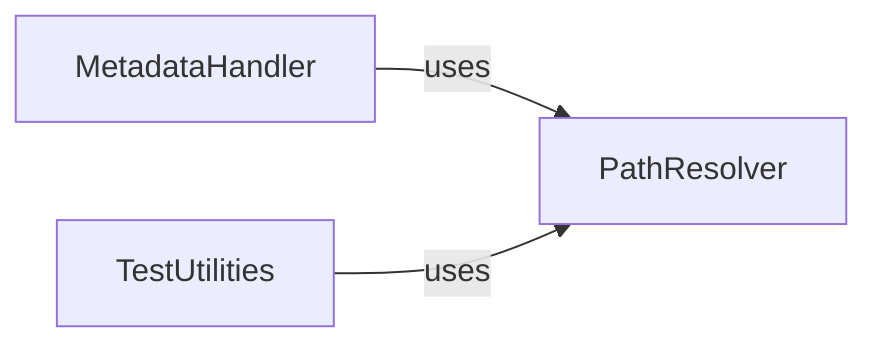

## Component Details

This graph describes the core utility components of the typeshed project. The `PathResolver` component is responsible for defining and resolving various file and directory paths within the project structure. The `MetadataHandler` component manages the reading, parsing, and updating of `METADATA.toml` files, providing structured access to configuration details. The `TestUtilities` component offers general utilities for testing and project management, including virtual environment management and parsing configuration files. The `MetadataHandler` and `TestUtilities` components both depend on `PathResolver` for their path resolution needs, indicating a foundational role for `PathResolver` in the system's file operations.

### PathResolver
Provides utility functions for resolving various file and directory paths within the typeshed project structure, including paths for distributions, tests, and allowlists. It also defines core path constants.

**Related Classes/Methods**:

- <a href="https://github.com/python/typeshed/blob/master/lib/ts_utils/paths.py#L9-L9" target="_blank" rel="noopener noreferrer">`typeshed.lib.ts_utils.paths:TS_BASE_PATH` (9:9)</a>
- <a href="https://github.com/python/typeshed/blob/master/lib/ts_utils/paths.py#L10-L10" target="_blank" rel="noopener noreferrer">`typeshed.lib.ts_utils.paths:STDLIB_PATH` (10:10)</a>
- <a href="https://github.com/python/typeshed/blob/master/lib/ts_utils/paths.py#L11-L11" target="_blank" rel="noopener noreferrer">`typeshed.lib.ts_utils.paths:STUBS_PATH` (11:11)</a>
- <a href="https://github.com/python/typeshed/blob/master/lib/ts_utils/paths.py#L13-L13" target="_blank" rel="noopener noreferrer">`typeshed.lib.ts_utils.paths:PYPROJECT_PATH` (13:13)</a>
- <a href="https://github.com/python/typeshed/blob/master/lib/ts_utils/paths.py#L14-L14" target="_blank" rel="noopener noreferrer">`typeshed.lib.ts_utils.paths:REQUIREMENTS_PATH` (14:14)</a>
- <a href="https://github.com/python/typeshed/blob/master/lib/ts_utils/paths.py#L15-L15" target="_blank" rel="noopener noreferrer">`typeshed.lib.ts_utils.paths:GITIGNORE_PATH` (15:15)</a>
- <a href="https://github.com/python/typeshed/blob/master/lib/ts_utils/paths.py#L17-L17" target="_blank" rel="noopener noreferrer">`typeshed.lib.ts_utils.paths:TESTS_DIR` (17:17)</a>
- <a href="https://github.com/python/typeshed/blob/master/lib/ts_utils/paths.py#L18-L18" target="_blank" rel="noopener noreferrer">`typeshed.lib.ts_utils.paths:TEST_CASES_DIR` (18:18)</a>
- <a href="https://github.com/python/typeshed/blob/master/lib/ts_utils/paths.py#L20-L22" target="_blank" rel="noopener noreferrer">`typeshed.lib.ts_utils.paths:distribution_path` (20:22)</a>
- <a href="https://github.com/python/typeshed/blob/master/lib/ts_utils/paths.py#L25-L29" target="_blank" rel="noopener noreferrer">`typeshed.lib.ts_utils.paths:tests_path` (25:29)</a>
- <a href="https://github.com/python/typeshed/blob/master/lib/ts_utils/paths.py#L32-L33" target="_blank" rel="noopener noreferrer">`typeshed.lib.ts_utils.paths:test_cases_path` (32:33)</a>
- <a href="https://github.com/python/typeshed/blob/master/lib/ts_utils/paths.py#L36-L40" target="_blank" rel="noopener noreferrer">`typeshed.lib.ts_utils.paths:allowlists_path` (36:40)</a>

### MetadataHandler
Manages the reading, parsing, and updating of METADATA.toml files, including stub metadata, stubtest settings, and package dependencies. It provides structured access to configuration details for typeshed distributions.

**Related Classes/Methods**:

- <a href="https://github.com/python/typeshed/blob/master/lib/ts_utils/metadata.py#L57-L59" target="_blank" rel="noopener noreferrer">`typeshed.lib.ts_utils.metadata:metadata_path` (57:59)</a>
- <a href="https://github.com/python/typeshed/blob/master/lib/ts_utils/metadata.py#L64-L85" target="_blank" rel="noopener noreferrer">`typeshed.lib.ts_utils.metadata:StubtestSettings` (64:85)</a>
- <a href="https://github.com/python/typeshed/blob/master/lib/ts_utils/metadata.py#L89-L139" target="_blank" rel="noopener noreferrer">`typeshed.lib.ts_utils.metadata:read_stubtest_settings` (89:139)</a>
- <a href="https://github.com/python/typeshed/blob/master/lib/ts_utils/metadata.py#L144-L165" target="_blank" rel="noopener noreferrer">`typeshed.lib.ts_utils.metadata:StubMetadata` (144:165)</a>
- <a href="https://github.com/python/typeshed/blob/master/lib/ts_utils/metadata.py#L206-L316" target="_blank" rel="noopener noreferrer">`typeshed.lib.ts_utils.metadata:read_metadata` (206:316)</a>
- <a href="https://github.com/python/typeshed/blob/master/lib/ts_utils/metadata.py#L319-L333" target="_blank" rel="noopener noreferrer">`typeshed.lib.ts_utils.metadata:update_metadata` (319:333)</a>
- <a href="https://github.com/python/typeshed/blob/master/lib/ts_utils/metadata.py#L336-L338" target="_blank" rel="noopener noreferrer">`typeshed.lib.ts_utils.metadata:parse_requires` (336:338)</a>
- <a href="https://github.com/python/typeshed/blob/master/lib/ts_utils/metadata.py#L341-L343" target="_blank" rel="noopener noreferrer">`typeshed.lib.ts_utils.metadata:PackageDependencies` (341:343)</a>
- <a href="https://github.com/python/typeshed/blob/master/lib/ts_utils/metadata.py#L347-L348" target="_blank" rel="noopener noreferrer">`typeshed.lib.ts_utils.metadata:get_pypi_name_to_typeshed_name_mapping` (347:348)</a>
- <a href="https://github.com/python/typeshed/blob/master/lib/ts_utils/metadata.py#L352-L375" target="_blank" rel="noopener noreferrer">`typeshed.lib.ts_utils.metadata:read_dependencies` (352:375)</a>
- <a href="https://github.com/python/typeshed/blob/master/lib/ts_utils/metadata.py#L379-L397" target="_blank" rel="noopener noreferrer">`typeshed.lib.ts_utils.metadata:get_recursive_requirements` (379:397)</a>

### TestUtilities
Provides a collection of general utilities for testing and project management within typeshed, including printing functions, virtual environment management, parsing requirements and version files, and generating stubtest-related arguments. It depends on PathResolver for path resolution.

**Related Classes/Methods**:

- <a href="https://github.com/python/typeshed/blob/master/lib/ts_utils/utils.py#L43-L46" target="_blank" rel="noopener noreferrer">`typeshed.lib.ts_utils.utils:print_command` (43:46)</a>
- <a href="https://github.com/python/typeshed/blob/master/lib/ts_utils/utils.py#L49-L50" target="_blank" rel="noopener noreferrer">`typeshed.lib.ts_utils.utils:print_info` (49:50)</a>
- <a href="https://github.com/python/typeshed/blob/master/lib/ts_utils/utils.py#L53-L58" target="_blank" rel="noopener noreferrer">`typeshed.lib.ts_utils.utils:print_error` (53:58)</a>
- <a href="https://github.com/python/typeshed/blob/master/lib/ts_utils/utils.py#L61-L62" target="_blank" rel="noopener noreferrer">`typeshed.lib.ts_utils.utils:print_success_msg` (61:62)</a>
- <a href="https://github.com/python/typeshed/blob/master/lib/ts_utils/utils.py#L65-L72" target="_blank" rel="noopener noreferrer">`typeshed.lib.ts_utils.utils:print_divider` (65:72)</a>
- <a href="https://github.com/python/typeshed/blob/master/lib/ts_utils/utils.py#L75-L76" target="_blank" rel="noopener noreferrer">`typeshed.lib.ts_utils.utils:print_time` (75:76)</a>
- <a href="https://github.com/python/typeshed/blob/master/lib/ts_utils/utils.py#L85-L88" target="_blank" rel="noopener noreferrer">`typeshed.lib.ts_utils.utils:venv_python` (85:88)</a>
- <a href="https://github.com/python/typeshed/blob/master/lib/ts_utils/utils.py#L97-L103" target="_blank" rel="noopener noreferrer">`typeshed.lib.ts_utils.utils:parse_requirements` (97:103)</a>
- <a href="https://github.com/python/typeshed/blob/master/lib/ts_utils/utils.py#L106-L107" target="_blank" rel="noopener noreferrer">`typeshed.lib.ts_utils.utils:get_mypy_req` (106:107)</a>
- <a href="https://github.com/python/typeshed/blob/master/lib/ts_utils/utils.py#L122-L136" target="_blank" rel="noopener noreferrer">`typeshed.lib.ts_utils.utils:parse_stdlib_versions_file` (122:136)</a>
- <a href="https://github.com/python/typeshed/blob/master/lib/ts_utils/utils.py#L139-L144" target="_blank" rel="noopener noreferrer">`typeshed.lib.ts_utils.utils:supported_versions_for_module` (139:144)</a>
- <a href="https://github.com/python/typeshed/blob/master/lib/ts_utils/utils.py#L158-L164" target="_blank" rel="noopener noreferrer">`typeshed.lib.ts_utils.utils:DistributionTests` (158:164)</a>
- <a href="https://github.com/python/typeshed/blob/master/lib/ts_utils/utils.py#L167-L175" target="_blank" rel="noopener noreferrer">`typeshed.lib.ts_utils.utils:distribution_info` (167:175)</a>
- <a href="https://github.com/python/typeshed/blob/master/lib/ts_utils/utils.py#L178-L186" target="_blank" rel="noopener noreferrer">`typeshed.lib.ts_utils.utils:get_all_testcase_directories` (178:186)</a>
- <a href="https://github.com/python/typeshed/blob/master/lib/ts_utils/utils.py#L189-L201" target="_blank" rel="noopener noreferrer">`typeshed.lib.ts_utils.utils:allowlists` (189:201)</a>
- <a href="https://github.com/python/typeshed/blob/master/lib/ts_utils/utils.py#L180-L189" target="_blank" rel="noopener noreferrer">`typeshed.lib.ts_utils.utils:NamedTemporaryFile` (180:189)</a>
- <a href="https://github.com/python/typeshed/blob/master/lib/ts_utils/utils.py#L230-L232" target="_blank" rel="noopener noreferrer">`typeshed.lib.ts_utils.utils:get_gitignore_spec` (230:232)</a>
- <a href="https://github.com/python/typeshed/blob/master/lib/ts_utils/utils.py#L235-L239" target="_blank" rel="noopener noreferrer">`typeshed.lib.ts_utils.utils:spec_matches_path` (235:239)</a>
- <a href="https://github.com/python/typeshed/blob/master/lib/ts_utils/utils.py#L247-L253" target="_blank" rel="noopener noreferrer">`typeshed.lib.ts_utils.utils:allowlist_stubtest_arguments` (247:253)</a>

### [FAQ](https://github.com/CodeBoarding/GeneratedOnBoardings/tree/main?tab=readme-ov-file#faq)