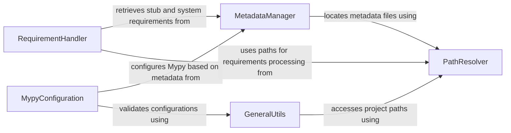

## Component Details

This architecture analysis of `typeshed` reveals a well-structured system primarily focused on managing Python type stubs. The core functionality revolves around metadata handling, path resolution, requirement processing, and Mypy configuration. The `MetadataManager` acts as a central hub for all stub-related metadata, relying on `PathResolver` for file location. `RequirementHandler` and `MypyConfiguration` interact with the `MetadataManager` to retrieve necessary information for dependency management and type checking, respectively. `GeneralUtils` provides a suite of common utilities that support various operations across these components, ensuring efficient and accurate processing of type stubs.

### MetadataManager
Manages all aspects of stub metadata, including reading, updating, and parsing dependencies from METADATA.toml files. It defines data structures for stub metadata and stubtest settings, and provides utilities for mapping PyPI names to Typeshed names and recursively gathering requirements.

**Related Classes/Methods**:

- <a href="https://github.com/python/typeshed/blob/master/lib/ts_utils/metadata.py#L57-L59" target="_blank" rel="noopener noreferrer">`typeshed.lib.ts_utils.metadata:metadata_path` (57:59)</a>
- <a href="https://github.com/python/typeshed/blob/master/lib/ts_utils/metadata.py#L64-L85" target="_blank" rel="noopener noreferrer">`typeshed.lib.ts_utils.metadata.StubtestSettings` (64:85)</a>
- <a href="https://github.com/python/typeshed/blob/master/lib/ts_utils/metadata.py#L81-L85" target="_blank" rel="noopener noreferrer">`typeshed.lib.ts_utils.metadata.StubtestSettings:system_requirements_for_platform` (81:85)</a>
- <a href="https://github.com/python/typeshed/blob/master/lib/ts_utils/metadata.py#L89-L139" target="_blank" rel="noopener noreferrer">`typeshed.lib.ts_utils.metadata:read_stubtest_settings` (89:139)</a>
- <a href="https://github.com/python/typeshed/blob/master/lib/ts_utils/metadata.py#L144-L165" target="_blank" rel="noopener noreferrer">`typeshed.lib.ts_utils.metadata.StubMetadata` (144:165)</a>
- <a href="https://github.com/python/typeshed/blob/master/lib/ts_utils/metadata.py#L206-L316" target="_blank" rel="noopener noreferrer">`typeshed.lib.ts_utils.metadata:read_metadata` (206:316)</a>
- <a href="https://github.com/python/typeshed/blob/master/lib/ts_utils/metadata.py#L319-L333" target="_blank" rel="noopener noreferrer">`typeshed.lib.ts_utils.metadata:update_metadata` (319:333)</a>
- <a href="https://github.com/python/typeshed/blob/master/lib/ts_utils/metadata.py#L336-L338" target="_blank" rel="noopener noreferrer">`typeshed.lib.ts_utils.metadata:parse_requires` (336:338)</a>
- <a href="https://github.com/python/typeshed/blob/master/lib/ts_utils/metadata.py#L347-L348" target="_blank" rel="noopener noreferrer">`typeshed.lib.ts_utils.metadata:get_pypi_name_to_typeshed_name_mapping` (347:348)</a>
- <a href="https://github.com/python/typeshed/blob/master/lib/ts_utils/metadata.py#L352-L375" target="_blank" rel="noopener noreferrer">`typeshed.lib.ts_utils.metadata:read_dependencies` (352:375)</a>
- <a href="https://github.com/python/typeshed/blob/master/lib/ts_utils/metadata.py#L379-L397" target="_blank" rel="noopener noreferrer">`typeshed.lib.ts_utils.metadata:get_recursive_requirements` (379:397)</a>
- <a href="https://github.com/python/typeshed/blob/master/lib/ts_utils/metadata.py#L201-L202" target="_blank" rel="noopener noreferrer">`typeshed.lib.ts_utils.metadata.NoSuchStubError` (201:202)</a>

### PathResolver
Provides utility functions for resolving various file and directory paths within the typeshed project structure, including paths for distributions, tests, and allowlists.

**Related Classes/Methods**:

- <a href="https://github.com/python/typeshed/blob/master/lib/ts_utils/paths.py#L20-L22" target="_blank" rel="noopener noreferrer">`typeshed.lib.ts_utils.paths:distribution_path` (20:22)</a>
- <a href="https://github.com/python/typeshed/blob/master/lib/ts_utils/paths.py#L25-L29" target="_blank" rel="noopener noreferrer">`typeshed.lib.ts_utils.paths:tests_path` (25:29)</a>
- <a href="https://github.com/python/typeshed/blob/master/lib/ts_utils/paths.py#L32-L33" target="_blank" rel="noopener noreferrer">`typeshed.lib.ts_utils.paths:test_cases_path` (32:33)</a>
- <a href="https://github.com/python/typeshed/blob/master/lib/ts_utils/paths.py#L36-L40" target="_blank" rel="noopener noreferrer">`typeshed.lib.ts_utils.paths:allowlists_path` (36:40)</a>

### RequirementHandler
Handles the retrieval and processing of external stub requirements and system-specific requirements for stub testing, interacting with the MetadataManager to obtain dependency information.

**Related Classes/Methods**:

- <a href="https://github.com/python/typeshed/blob/master/lib/ts_utils/requirements.py#L14-L18" target="_blank" rel="noopener noreferrer">`typeshed.lib.ts_utils.requirements:get_external_stub_requirements` (14:18)</a>
- <a href="https://github.com/python/typeshed/blob/master/lib/ts_utils/requirements.py#L21-L28" target="_blank" rel="noopener noreferrer">`typeshed.lib.ts_utils.requirements:get_stubtest_system_requirements` (21:28)</a>

### MypyConfiguration
Responsible for generating and validating Mypy configurations based on distribution information, ensuring Mypy can correctly analyze stub files.

**Related Classes/Methods**:

- <a href="https://github.com/python/typeshed/blob/master/lib/ts_utils/mypy.py#L27-L49" target="_blank" rel="noopener noreferrer">`typeshed.lib.ts_utils.mypy:mypy_configuration_from_distribution` (27:49)</a>
- <a href="https://github.com/python/typeshed/blob/master/lib/ts_utils/mypy.py#L36-L46" target="_blank" rel="noopener noreferrer">`typeshed.lib.ts_utils.mypy.mypy_configuration_from_distribution.validate_configuration` (36:46)</a>

### GeneralUtils
Provides a collection of miscellaneous utility functions supporting various operations across the typeshed project, including parsing versions, handling distribution information, and managing test case directories and allowlists.

**Related Classes/Methods**:

- <a href="https://github.com/python/typeshed/blob/master/lib/ts_utils/utils.py#L106-L107" target="_blank" rel="noopener noreferrer">`typeshed.lib.ts_utils.utils:get_mypy_req` (106:107)</a>
- <a href="https://github.com/python/typeshed/blob/master/lib/ts_utils/utils.py#L122-L136" target="_blank" rel="noopener noreferrer">`typeshed.lib.ts_utils.utils:parse_stdlib_versions_file` (122:136)</a>
- <a href="https://github.com/python/typeshed/blob/master/lib/ts_utils/utils.py#L167-L175" target="_blank" rel="noopener noreferrer">`typeshed.lib.ts_utils.utils:distribution_info` (167:175)</a>
- <a href="https://github.com/python/typeshed/blob/master/lib/ts_utils/utils.py#L178-L186" target="_blank" rel="noopener noreferrer">`typeshed.lib.ts_utils.utils:get_all_testcase_directories` (178:186)</a>
- <a href="https://github.com/python/typeshed/blob/master/lib/ts_utils/utils.py#L247-L253" target="_blank" rel="noopener noreferrer">`typeshed.lib.ts_utils.utils:allowlist_stubtest_arguments` (247:253)</a>
- <a href="https://github.com/python/typeshed/blob/master/lib/ts_utils/utils.py#L97-L103" target="_blank" rel="noopener noreferrer">`typeshed.lib.ts_utils.utils:parse_requirements` (97:103)</a>
- <a href="https://github.com/python/typeshed/blob/master/lib/ts_utils/utils.py#L34-L35" target="_blank" rel="noopener noreferrer">`typeshed.lib.ts_utils.utils:strip_comments` (34:35)</a>
- <a href="https://github.com/python/typeshed/blob/master/lib/ts_utils/utils.py#L147-L150" target="_blank" rel="noopener noreferrer">`typeshed.lib.ts_utils.utils._parse_version` (147:150)</a>
- <a href="https://github.com/python/typeshed/blob/master/lib/ts_utils/utils.py#L189-L201" target="_blank" rel="noopener noreferrer">`typeshed.lib.ts_utils.utils.allowlists` (189:201)</a>

### [FAQ](https://github.com/CodeBoarding/GeneratedOnBoardings/tree/main?tab=readme-ov-file#faq)